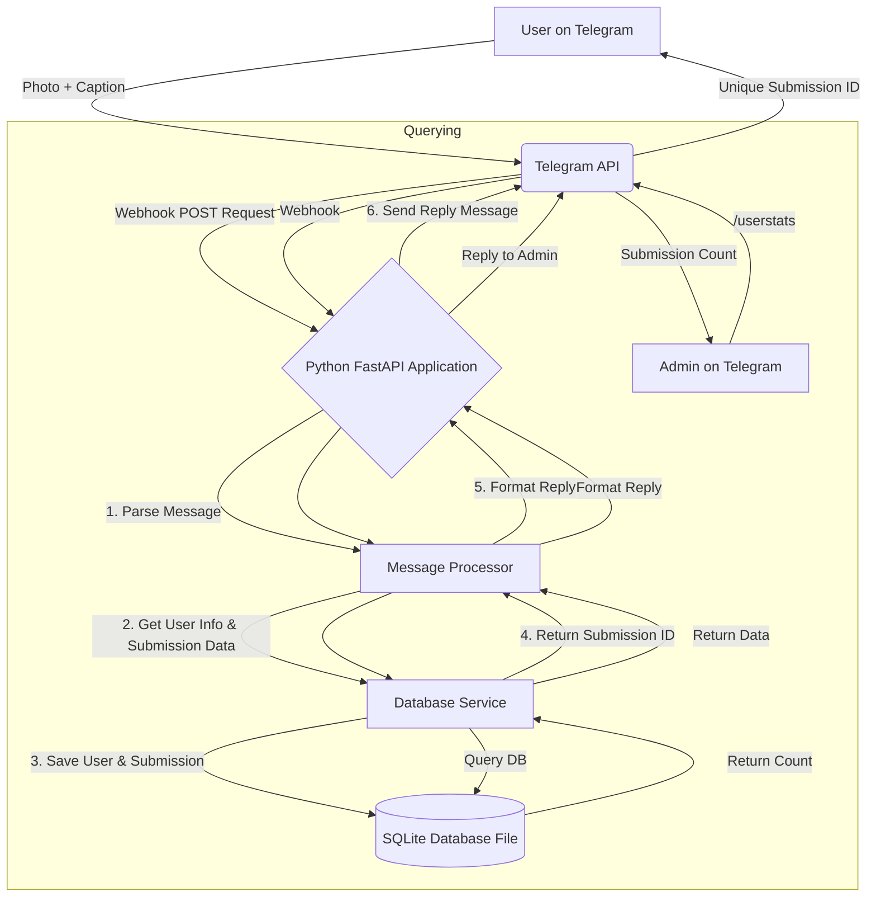

# Design Plan: Telegram Product Submission Tracker Bot

## 1. Executive Summary & Goals

This document outlines the design and implementation plan for a Telegram bot that allows users to submit product/package information. The bot will receive an image with a descriptive caption, persist this information, and provide a unique tracking ID for each submission.

- **Primary Objective:** To create an automated system via a Telegram bot for tracking item submissions from various users.
- **Key Goals:**
  1.  **Automate Submission:** Enable users to submit an item by sending a single message containing a photo and a caption.
  2.  **Data Persistence:** Securely store submission data (image reference, user info, text) in a structured database.
  3.  **Tracking & Retrieval:** Provide a unique ID for each submission and implement functionality to query submission counts per user.

## 2. Current Situation Analysis

The current process is manual, likely involving direct messaging or group chats as seen in the provided screenshots. This method is prone to errors, difficult to track, and does not scale. There is no central database, making it impossible to get accurate counts or historical data without manually reviewing the entire chat history. The user's request stems from the need to formalize and automate this tracking process.

## 3. Proposed Solution / Refactoring Strategy

### 3.1. High-level Design / Architectural Overview

We will build a bot backend using Python. The bot will interact with the Telegram API via webhooks for real-time message processing. A local **SQLite** database file will be used for data persistence, providing a simple and serverless-friendly solution. The application can be deployed on any platform that supports Python applications, such as **Vercel** or a traditional VPS.

This architecture is simple, requires no external database setup, and is very cost-effective.

### 3.2. Key Components / Modules

- **Telegram Bot Handler (`main.py`):** The main entry point. It will use a Python web framework (e.g., FastAPI) to create a webhook endpoint. It will receive updates from Telegram and delegate them to the appropriate processor.
- **Message Processor (`processor.py`):** Contains the core business logic. It will validate incoming messages (e.g., ensure they contain a photo), extract the user data, photo `file_id`, and caption, and coordinate with the Database Service.
- **Database Service (`database.py`):** An abstraction layer for all database interactions. It will handle creating/updating users and creating new submission records in the SQLite database. It will use Python's built-in `sqlite3` module.
- **Configuration (`config.py`):** Manages environment variables for sensitive data like the Telegram Bot Token and the database file path.

### 3.3. Detailed Action Plan / Phases

#### Phase 1: Foundation & Core Submission Logic

- **Objective(s):** Set up all required services and implement the primary user workflow of submitting an item.
- **Priority:** High

- **Task 1.1: Environment Setup**

  - **Rationale/Goal:** Create the necessary accounts and assets for development.
  - **Estimated Effort:** S
  - **Deliverable/Criteria for Completion:**
    - A new Telegram Bot is created via @BotFather and the API token is saved.

- **Task 1.2: Database Schema Definition**

  - **Rationale/Goal:** Create the database structure to store all required information.
  - **Estimated Effort:** S
  - **Deliverable/Criteria for Completion:**
    - The `database.py` module includes a function to create `users` and `submissions` tables in the SQLite database file if they don't exist.
    - The schema is defined as per the Data Model in section 3.4.

- **Task 1.3: Project Initialization**

  - **Rationale/Goal:** Set up the local Python development environment.
  - **Estimated Effort:** S
  - **Deliverable/Criteria for Completion:**
    - A new Python project is created with a virtual environment.
    - Dependencies (`fastapi`, `uvicorn`, `python-telegram-bot`, `python-dotenv`) are installed.
    - Project file structure (`main.py`, `processor.py`, `database.py`, `config.py`, `.env`) is created.

- **Task 1.4: Implement Core Submission Workflow**
  - **Rationale/Goal:** Build the main functionality of the bot.
  - **Estimated Effort:** M
  - **Deliverable/Criteria for Completion:**
    - The bot correctly processes an incoming message with a photo and caption.
    - The user's information is saved or updated in the `users` table.
    - A new record is created in the `submissions` table containing the user's ID, the Telegram `file_id` of the photo, and the caption text.
    - The bot replies to the user with a confirmation message containing the unique ID of the new submission record.

#### Phase 2: Deployment & Webhook Integration

- **Objective(s):** Deploy the bot to a live environment and switch from local polling to production-ready webhooks.
- **Priority:** High

- **Task 2.1: Prepare for Deployment**

  - **Rationale/Goal:** Configure the project to run on a serverless platform.
  - **Estimated Effort:** S
  - **Deliverable/Criteria for Completion:**
    - A `requirements.txt` file is generated.
    - A `vercel.json` configuration file is created to route requests to the FastAPI application.

- **Task 2.2: Deploy to Vercel**

  - **Rationale/Goal:** Make the bot accessible online.
  - **Estimated Effort:** S
  - **Deliverable/Criteria for Completion:**
    - The project is connected to a Git repository (e.g., GitHub).
    - The Vercel project is created and linked to the repository.
    - Environment variables are configured in the Vercel project settings.
    - The application is successfully deployed and a public URL is available.

- **Task 2.3: Set Telegram Webhook**
  - **Rationale/Goal:** Configure Telegram to send updates to the deployed application instead of using local polling.
  - **Estimated Effort:** S
  - **Deliverable/Criteria for Completion:**
    - The bot's webhook is set to the Vercel deployment URL using a request to the Telegram API.
    - The bot responds to messages in real-time in the production environment.

#### Phase 3: Querying & Admin Features

- **Objective(s):** Add functionality for users and admins to retrieve submission statistics.
- **Priority:** Medium

- **Task 3.1: Implement User Statistics Command**

  - **Rationale/Goal:** Allow users to track their own activity.
  - **Estimated Effort:** S
  - **Deliverable/Criteria for Completion:**
    - A new command, `/mystats`, is implemented.
    - When a user sends `/mystats`, the bot queries the database and replies with the total number of submissions they have made.

- **Task 3.2: Implement Admin Role & Statistics Command**
  - **Rationale/Goal:** Provide administrators with the ability to monitor all user activity.
  - **Estimated Effort:** M
  - **Deliverable/Criteria for Completion:**
    - A list of admin Telegram IDs is added to the configuration.
    - A new command, `/userstats <telegram_user_id>`, is implemented.
    - The command is restricted to admin users only.
    - When an admin uses the command, the bot returns the submission count for the specified user.

### 3.4. Data Model Changes

Two tables will be created in the SQLite database.

**Table: `users`**
| Column | Type | Constraints | Description |
| :--- | :--- | :--- | :--- |
| `telegram_id` | `INTEGER` | **Primary Key**, Not Null | The user's unique Telegram ID. |
| `first_name` | `TEXT` | | The user's first name. |
| `username` | `TEXT` | | The user's Telegram @username. |
| `created_at` | `TEXT` | Not Null, Default `CURRENT_TIMESTAMP` | Timestamp of user's first interaction. |

**Table: `submissions`**
| Column | Type | Constraints | Description |
| :--- | :--- | :--- | :--- |
| `id` | `INTEGER` | **Primary Key**, `AUTOINCREMENT` | The unique ID for the submission. |
| `user_id` | `INTEGER` | **Foreign Key** -> `users.telegram_id` | The ID of the user who made the submission. |
| `image_file_id` | `TEXT` | Not Null | Telegram's unique ID for the submitted photo. |
| `caption_text` | `TEXT` | | The caption sent with the photo. |
| `created_at` | `TEXT` | Not Null, Default `CURRENT_TIMESTAMP` | Timestamp of the submission. |

### 3.5. API Design / Interface Changes

The primary interface is the Telegram Bot API. The bot will listen for:

- **Photo Messages:** Messages of type `photo` with a `caption`. This is the main trigger for the submission workflow.
- **Commands:** Text messages starting with `/`.
  - `/start`: Standard welcome message.
  - `/mystats`: User-facing command to get personal submission count.
  - `/userstats <user_id>`: Admin-only command to get submission count for any user.

## 4. Key Considerations & Risk Mitigation

### 4.1. Technical Risks & Challenges

- **Invalid Input:** Users might send text-only messages, photos without captions, or malformed commands.
  - **Mitigation:** The bot will implement input validation. It will reply with helpful instructions if the input is invalid (e.g., "Please send a photo with a caption.").
- **Rate Limiting:** Telegram imposes rate limits on bot API requests. High traffic could lead to temporary blocks.
  - **Mitigation:** The code will handle potential `Retry-After` headers from Telegram. The serverless architecture helps by scaling instances, but the ultimate bottleneck is the Telegram API itself. For the expected initial load, this is a low risk.
- **Security:** The Bot Token is highly sensitive.
  - **Mitigation:** All secrets will be stored as environment variables and never hardcoded in the source code.
- **Data Persistence:** The SQLite database is a single file.
  - **Mitigation:** For production deployments, a regular backup strategy for the database file (`bot_database.db`) should be implemented.

### 4.2. Dependencies

- **External Services:** The bot is fully dependent on the availability of the Telegram API and the hosting platform (e.g., Vercel).
- **Task Dependencies:** Phase 2 (Deployment) is dependent on the completion of Phase 1 (Core Logic). Phase 3 (Admin Features) can be worked on after Phase 1 is complete, but is best tested after deployment.

### 4.3. Non-Functional Requirements (NFRs) Addressed

- **Reliability:** Using a simple file-based database reduces external dependencies. Data durability depends on the hosting environment's file system and backup strategy.
- **Scalability:** The serverless architecture will automatically scale with the number of incoming requests. SQLite is suitable for low-to-medium write concurrency, which is typical for a bot like this.
- **Cost-Effectiveness:** The chosen technology stack (Python with SQLite) is free and open-source. Hosting on platforms like Vercel can be done within a generous free tier.
- **Usability:** The bot interface is simple and leverages a familiar platform (Telegram). The workflow is intuitive: send one message to log an item.

## 5. Success Metrics / Validation Criteria

- The bot successfully processes >99% of valid photo-with-caption submissions.
- The average response time from submission to receiving the confirmation ID is less than 3 seconds.
- Data integrity is maintained: all submissions are correctly associated with the correct user in the database.
- Admin and user statistic commands return accurate counts.

## 6. Assumptions Made

- The "user identifier" mentioned in the conversation is best served by the unique and unchangeable Telegram User ID. The name provided in the caption will be stored as supplementary data (`caption_text`).
- The "unique ID" for a submission can be the auto-incrementing integer primary key generated by SQLite, which is guaranteed to be unique.
- For initial implementation, a hardcoded list of admin `telegram_id`s in the environment variables is sufficient for access control.

## 7. Open Questions / Areas for Further Investigation

- What should be the exact welcome message (`/start`) and instructional text for users?
- What is the expected format for the admin `/userstats` command? Should it accept a Telegram @username in addition to the numeric ID?
- Are there future plans to edit or delete submissions? (This is out of scope for the initial version but good to consider for database design).
- Does the admin need to view the submitted images, or are the counts sufficient? (The current plan stores the `file_id`, making image retrieval possible in a future phase).
